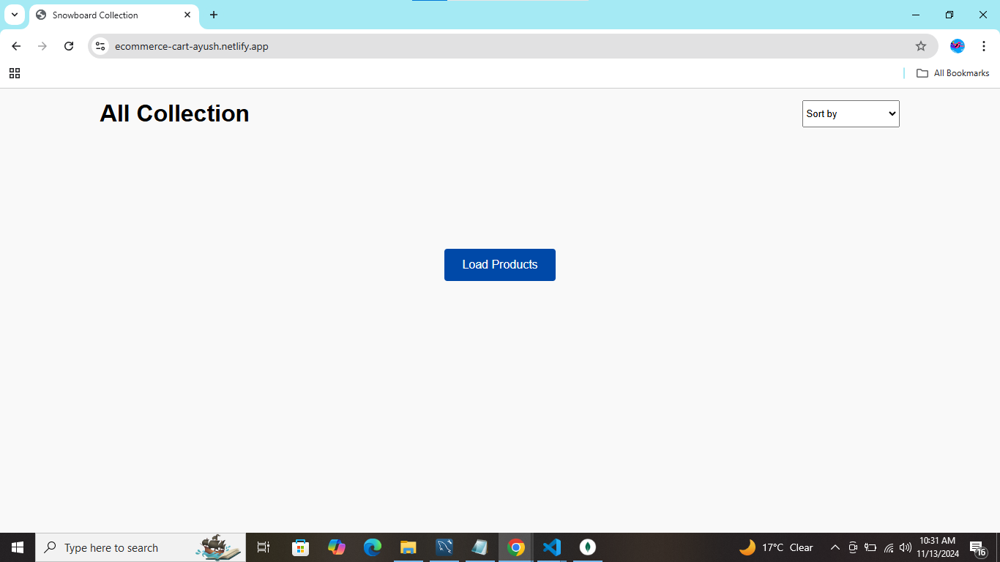
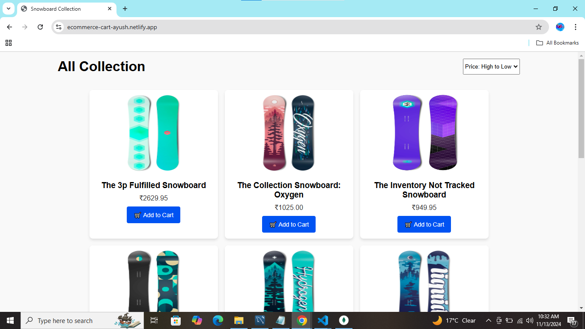
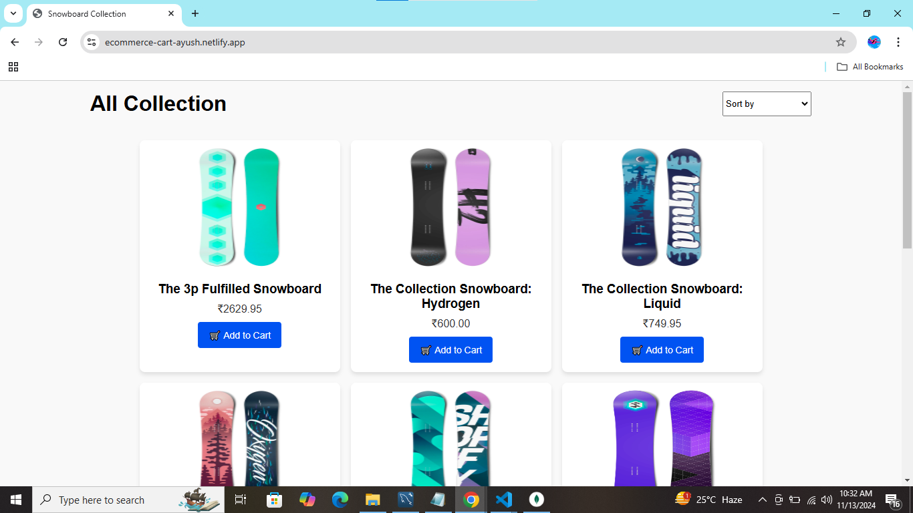

# E-Commerce Product Grid

An interactive product grid for an e-commerce site that fetches product data from a mock API, displays the products in a grid format, and allows sorting by price. Users can add items to the cart by clicking the "Add to Cart" button.

## Demo

Check out the live demo of the project [here](https://ecommerce-cart-ayush.netlify.app/).

## Features

- Fetch products from a mock API
- Display products in a responsive grid layout
- Sort products by price (low-to-high, high-to-low)
- "Add to Cart" button with a shopping cart icon
- Loading animation on fetch request
- Hide the "Load Products" button once products are loaded

## Screenshots

  
  
  

## Installation

1. Clone this repository:
git clone https://github.com/ayush7078/E-Commerce.git
Navigate to the project directory:
cd E-Commerce
Open index.html in your browser to view the project.

Usage
Click the "Load Products" button to fetch and display products from the mock API.
Use the "Sort by" dropdown to sort products by price.
Click "Add to Cart" to simulate adding a product to the cart.

Code Structure
HTML: Basic structure of the page with a header, main content, and a product grid.
CSS: Styles for layout, product cards, and responsiveness.
JavaScript: Logic for fetching data from the API, sorting products, and managing UI interactions.

Responsive Design
The project is fully responsive, designed to look good on both desktop and mobile devices.

API
https://run.mocky.io/v3/92348b3d-54f7-4dc5-8688-ec7d855b6cce?mocky-delay=500ms
